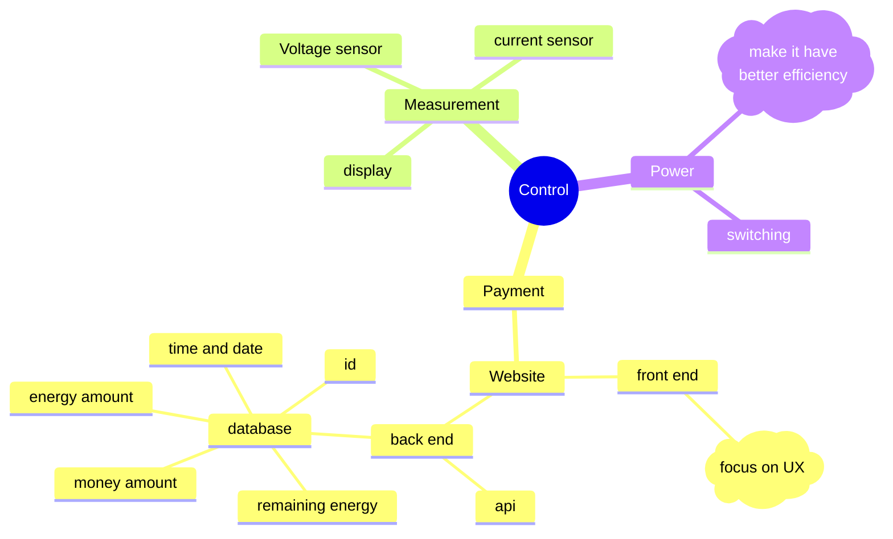
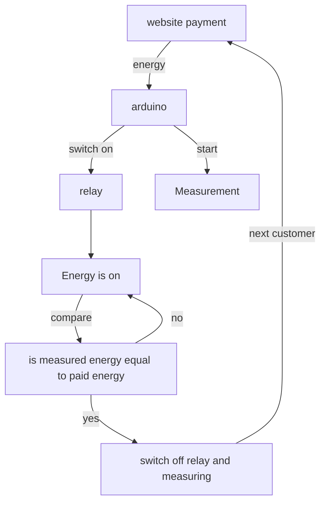
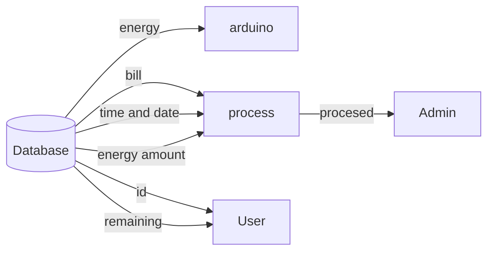

according to the source source of electricity for vehicle's propulsion

- hybird eletric vehicle (HEVs)
- Plug-in electric vehicles (PEVs)
- Fuel cell electric vehicle (FCEVs)

## The simplest thing we can do is

## database

## side project
the socket(EVSE)
five pins
  - control (pilot) pin
  - proxmity pins
  - phase
  - ground
  - nutral

