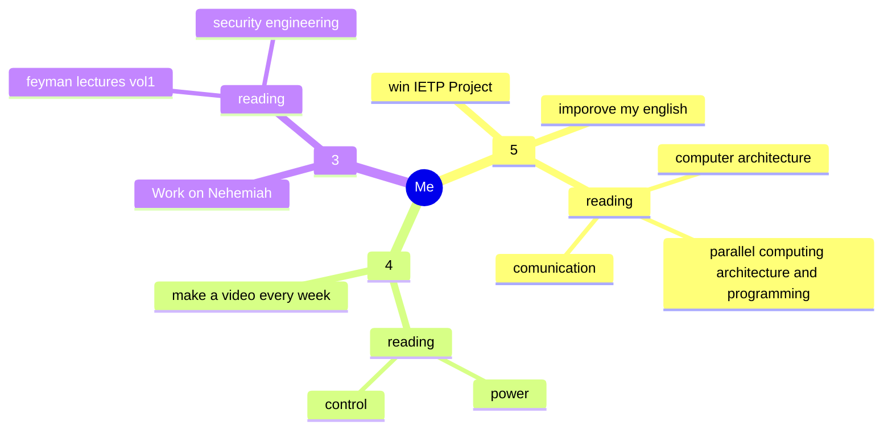
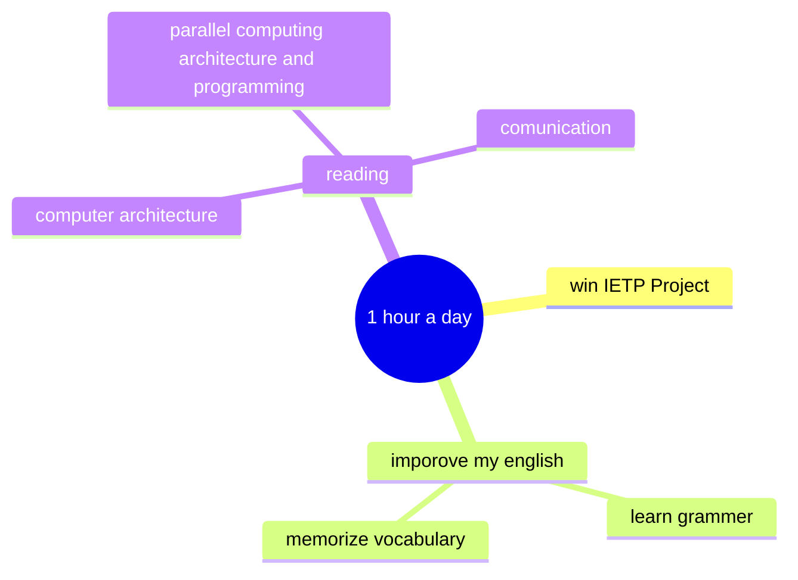

## This is my overview plan of this semester

```mermaid
mindmap
  root((Me))
   5
    win IETP Project
    imporove my english
    reading
      computer architecture
      parallel computing architecture and programming
      comunication 
   4
    make a video every week
    reading 
      power
      control
   3
    Work on Nehemiah
    reading
      feyman lectures vol1
      security engineering
```

## details

lets come to priorty one jobs 

```mermaid
mindmap
  root((1 hour a day))
    win IETP Project  
    imporove my english
      learn grammer
      memorize vocabulary
    reading
      computer architecture
      parallel computing architecture and programming
      comunication
```

